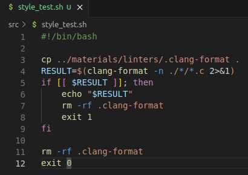
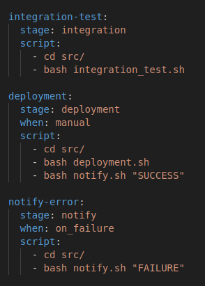

## Part 1. Настройка gitlab-runner

**== Задание ==**

##### Поднять виртуальную машину *Ubuntu Server 20.04 LTS*

##### Скачать и установить на виртуальную машину **gitlab-runner**

##### Запустить **gitlab-runner** и зарегистрировать его для использования в текущем проекте (*DO6_CICD*)

**== Решение ==**

1) Устанавливаем gitlab-runner:

    - `curl -L "https://packages.gitlab.com/install/repositories/runner/gitlab-runner/script.deb.sh" | sudo bash`

    - `apt-cache madison gitlab-runner`

    - `sudo apt-get install gitlab-runner=14.9.1`

2) Устанавливаем все необходимые пакеты в Ubuntu:

    - `sudo apt install make`

    - `sudo apt install gcc`

    - `sudo apt install clang-format`

3) Регистрируем проект:

    - `sudo gitlab-runner register`, указываем URL, токен и тэг

## Part 2. Сборка

**== Задание ==**

#### Написать этап для **CI** по сборке приложений из проекта *C2_SimpleBashUtils*:

##### В файле _gitlab-ci.yml_ добавить этап запуска сборки через мейк файл из проекта _C2_

##### Файлы, полученные после сборки (артефакты), сохранять в произвольную директорию со сроком хранения 30 дней.

**== Решение ==**

1) Этап по сборке приложений представлен в .gitlab-ci.yml `stage: build`:

2) Запускаем на Ubuntu gitlab-runner командой `gitlab-runner run`:

3) После того, как проект будет запушен, в разделе `CI/CD` -> `Pipelines` появится информация о результате:

    - Сборка прошла успешно:

## Part 3. Тест кодстайла

**== Задание ==**

#### Написать этап для **CI**, который запускает скрипт кодстайла (*clang-format*):

##### Если кодстайл не прошел, то "зафейлить" пайплайн

##### В пайплайне отобразить вывод утилиты *clang-format*

**== Решение ==**

1) Напишем скрипт `style_test.sh`, который будет проверять кодстайл. В случае, если будет нарушение кодстайла, выводится текст с ошибкой и скрипт завершается с кодом 1. В этом случае пайплайн будет зафейлен:

2) Дополним файл `.gitlab-ci.yml` новым этапом `check-style`:

3) Результат пайплайна:

    - При соответствии кодстайлу:

### Part 4. Интеграционные тесты

**== Задание ==**

#### Написать этап для **CI**, который запускает ваши интеграционные тесты из того же проекта:

##### Запускать этот этап автоматически только при условии, если сборка и тест кодстайла прошли успешно

##### Если тесты не прошли, то "зафейлить" пайплайн

##### В пайплайне отобразить вывод, что интеграционные тесты успешно прошли / провалились

**== Решение ==**

1) Напишем скрипты `src/integration_tests/cat_test.sh` и `src/integration_tests/grep_test.sh` для проверки проекта и создадим текстовый шаблон для `src/integration_tests/test.txt`.

2) Скрипт `src/integration_test.sh` запускает написанные нами скрипты и в случае ошибки возвращает код 1.

3) Дополним файл `.gitlab-ci.yml` новым этапом `integration-test`:

3) Результаты пайплайна:

    - При успешной проверке:

    - При провале теста cat:

    - В случае, если предыдущие тесты провалены:

### Part 5. Этап деплоя

**== Задание ==**

##### Подними вторую виртуальную машину Ubuntu Server 22.04 LTS.

#### Напиши этап для CD, который «разворачивает» проект на другой виртуальной машине.

##### Запусти этот этап вручную при условии, что все предыдущие этапы прошли успешно.

##### Напиши bash-скрипт, который при помощи ssh и scp копирует файлы, полученные после сборки (артефакты), в директорию /usr/local/bin второй виртуальной машины.

##### В файле gitlab-ci.yml добавь этап запуска написанного скрипта.

##### В случае ошибки «зафейли» пайплайн.

**== Решение ==**

1) Подготовка к выполнению задания:

    - После создания второй машины устанавливаем на ней владельцем дирректории **/usr/local/bin** пользователя *fossowan* командой: `chown andrei /usr/local/bin` .

    - На машине с **gitlab-runner** переключаемся на пользователя gitlab-runner `sudo su gitlab-runner`, создаем ssh-ключ `ssh-keygen` и устанавливаем беспарольное SSH копированием открытого ключа с помощью команды `ssh-copy-id andrei@192.168.0.15` .

    - Устанавливаем статическое соединение между машинами.

2) Создаем скрипт с копированием файлов через `scp`:

3) Добавляем новый этап в *.gitlab-ci.yml*:

    Перед запуском пайплайна добавляем пользователя gitlab-runner в sudoers

4) При успешном пайплайне этапов до деплоя в гитлабе пайплайн будет отображаться следующим образом:

5) При успешном пайплайне:

### Part 6. Дополнительно. Уведомления

**== Задание ==**

##### Настроить уведомления о успешном/неуспешном выполнении пайплайна через бота с именем "[ваш nickname] DO6 CI/CD" в *Telegram*

- Текст уведомления должен содержать информацию об успешности прохождения как этапа **CI**, так и этапа **CD**.
- В остальном текст уведомления может быть произвольным.

**== Решение ==**

1) Создаем бота в Телеграм с помощью [BotFather](https://t.me/BotFather):

2) Создаем скрипт *notify.sh*, со следующим содержанием:

Узнаем ID чата с помощью https://api.telegram.org/bot<YOUR_BOT_TOKEN>/getUpdates

3) Добавляем в *.gitlab-ci.yml* новый этап и дополняем этап деплоя. Финальный файл выглядит следующим образом:

Пример сообщений:

