# Simple Docker
## Contents
  1.1. [Готовый докер](#part-1-готовый-докер) \
  1.2. [Операции с контейнером](#part-2-операции-с-контейнером) \
  1.3. [Мини веб-сервер](#part-1-мини-веб-сервер) \
  1.4. [Свой докер](#part-4-свой-докер) \
  1.5. [Dockle](#part-5-dockle) \
  1.6. [Базовый Docker Compose](#part-6-базовый-docker-compose)

## Part 1. Готовый докер

В качестве конечной цели своей небольшой практики вы сразу выбрали написание докер образа для собственного веб сервера, а потому в начале вам нужно разобраться с уже готовым докер образом для сервера.
Ваш выбор пал на довольно простой **nginx**.

**== Задание ==**

##### Взять официальный докер образ с **nginx** и выкачать его при помощи `docker pull`
##### Проверить наличие докер образа через `docker images`
##### Запустить докер образ через `docker run -d [image_id|repository]`
##### Проверить, что образ запустился через `docker ps`
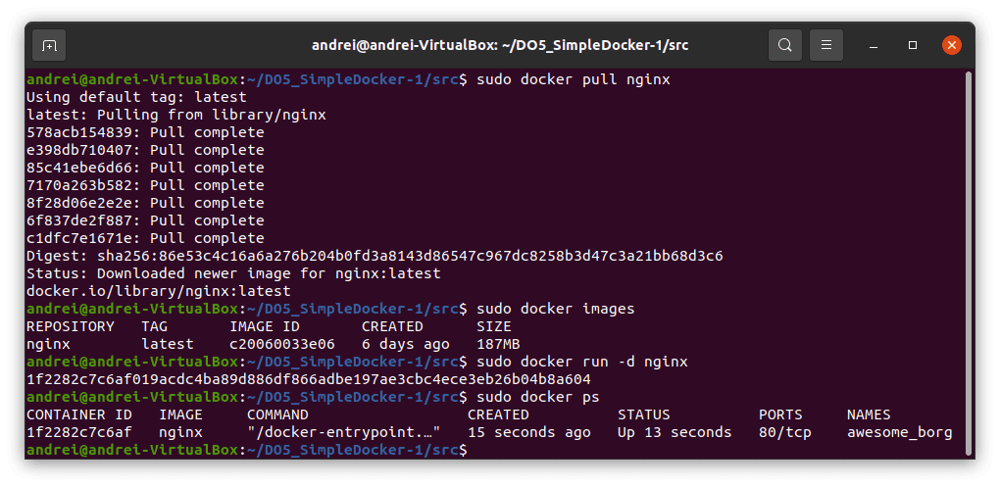

##### Посмотреть информацию о контейнере через `docker inspect [container_id|container_name]`
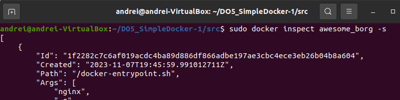
##### По выводу команды определить и поместить в отчёт размер контейнера, список замапленных портов и ip контейнера
Размер контейнера (с флагом -s, в kB));
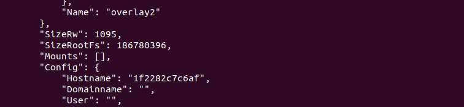
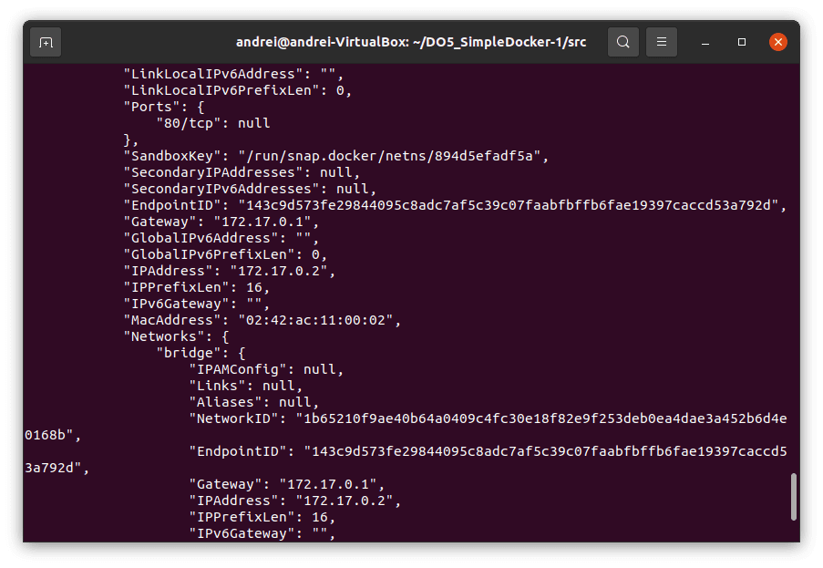
##### Остановить докер образ через `docker stop [container_id|container_name]`
##### Проверить, что образ остановился через `docker ps`
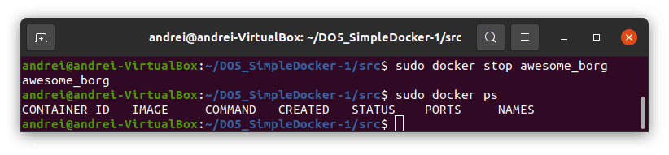
##### Запустить докер с замапленными портами 80 и 443 на локальную машину через команду *run*
##### Проверить, что в браузере по адресу *localhost:80* доступна стартовая страница **nginx**
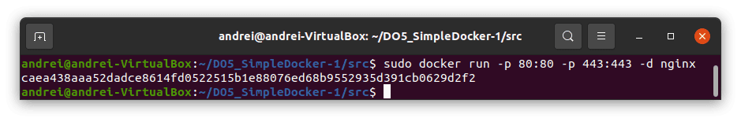
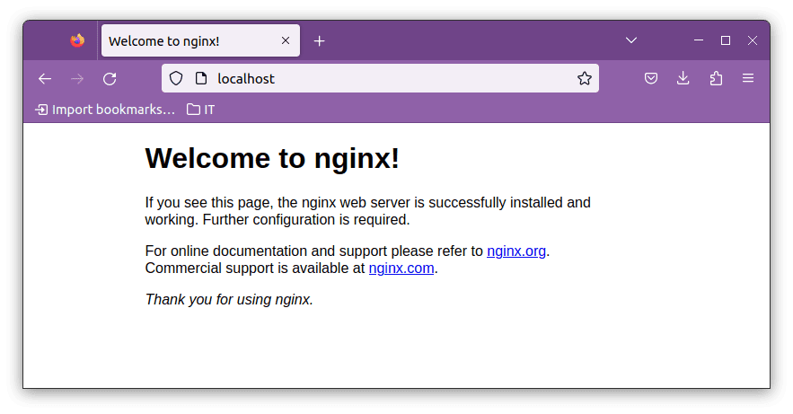
##### Перезапустить докер контейнер через `docker restart [container_id|container_name]`
##### Проверить любым способом, что контейнер запустился
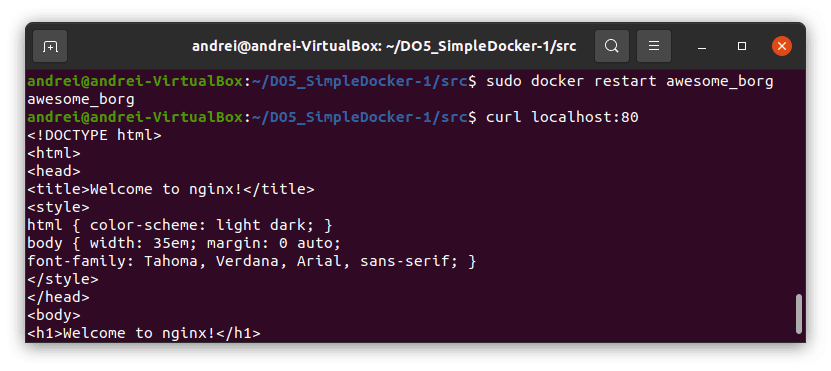

## Part 2. Операции с контейнером

Докер образ и контейнер готовы. Теперь можно покопаться в конфигурации **nginx** и отобразить статус страницы.

**== Задание ==**

##### Прочитать конфигурационный файл *nginx.conf* внутри докер образа через команду *exec*

##### Создать на локальной машине файл *nginx.conf*
##### Скопировать созданный файл *nginx.conf* внутрь докер образа через команду `docker cp`
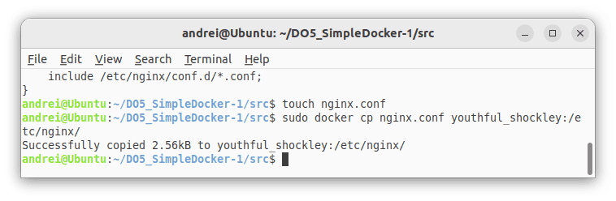
##### Настроить в нем по пути */status* отдачу страницы статуса сервера **nginx**
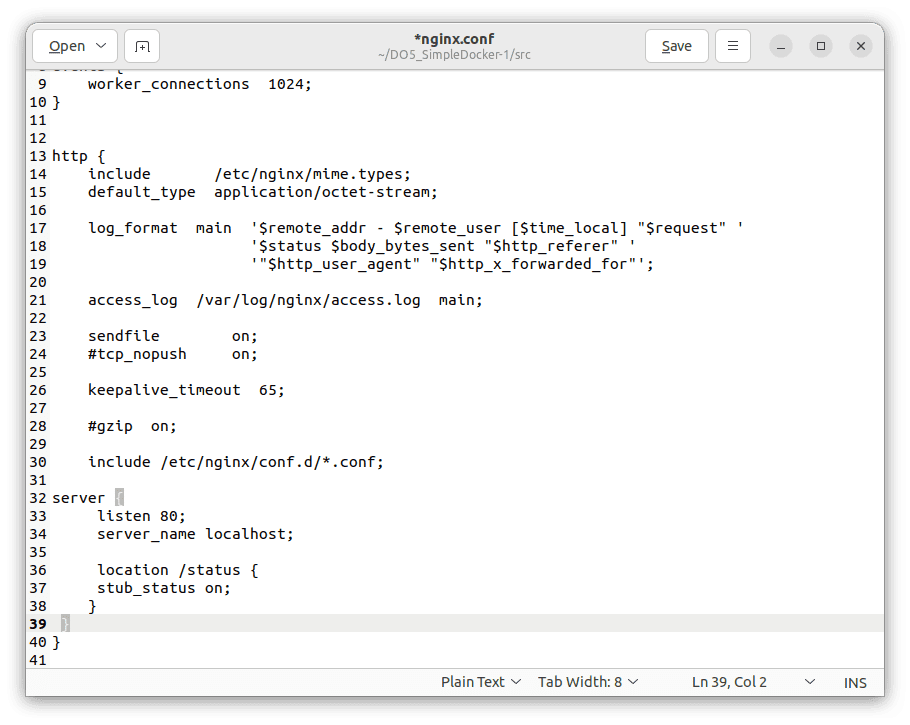

##### Перезапустить **nginx** внутри докер образа через команду *exec*
##### Проверить, что по адресу *localhost:80/status* отдается страничка со статусом сервера **nginx**
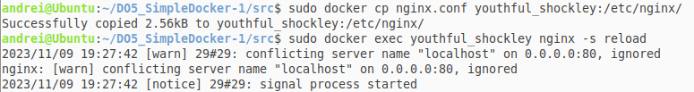

##### Экспортировать контейнер в файл *container.tar* через команду *export*
##### Остановить контейнер
##### Удалить образ через `docker rmi [image_id|repository]`, не удаляя перед этим контейнеры
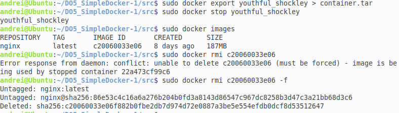
##### Импортировать контейнер обратно через команду *import*
##### Запустить импортированный контейнер
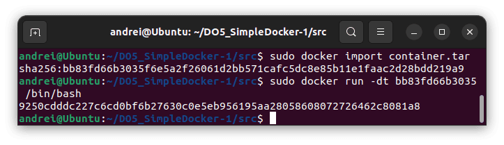

## Part 3. Мини веб-сервер

Настало время немного оторваться от докера, чтобы подготовиться к последнему этапу. Настало время написать свой сервер.

**== Задание ==**

##### Написать мини сервер на **C** и **FastCgi**, который будет возвращать простейшую страничку с надписью `Hello World!`
##### Запустить написанный мини сервер через *spawn-cgi* на порту 8080
##### Написать свой *nginx.conf*, который будет проксировать все запросы с 81 порта на *127.0.0.1:8080*
##### Проверить, что в браузере по *localhost:81* отдается написанная вами страничка
##### Положить файл *nginx.conf* по пути *./nginx/nginx.conf* (это понадобиться позже)

##### Запустим новый контейнер, скопируем конфиг и логику сервера в контейнер, установим требуемые утилиты для запуска мини веб-сервера на FastCGI
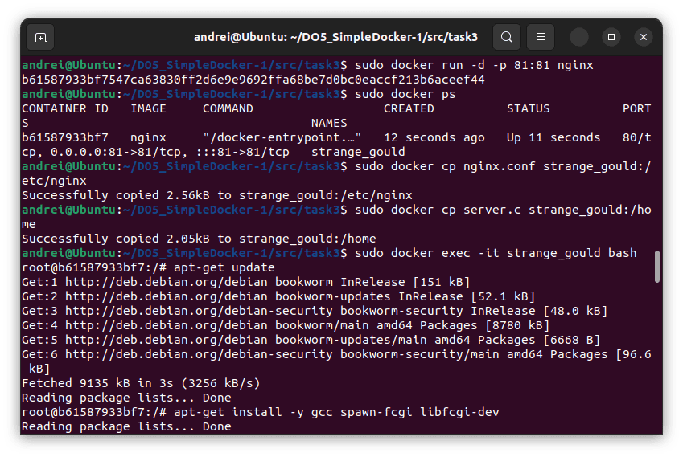

##### Скомпилируем и запустим наш мини веб-сервер через команду spawn-fcgi на порту 8080
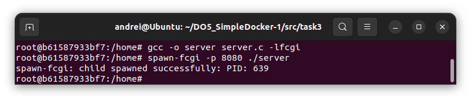

##### Проверяем, что все работает корректно
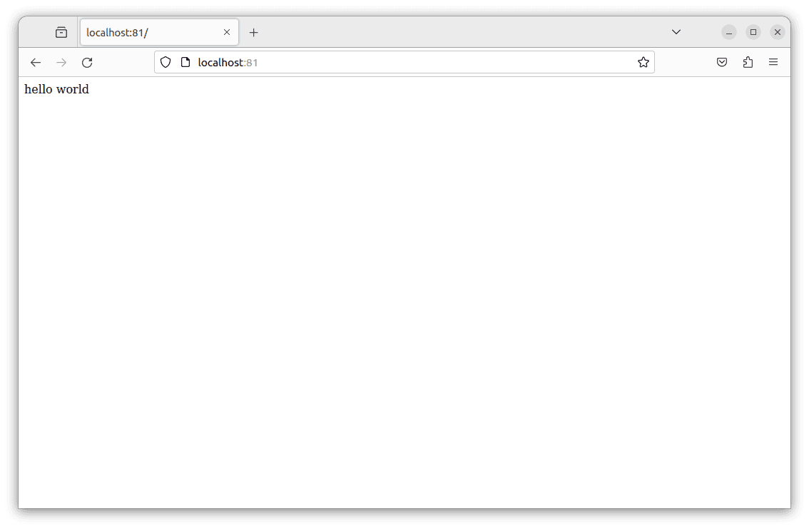

## Part 4. Свой докер

Теперь всё готово. Можно приступать к написанию докер образа для созданного сервера.

**== Задание ==**

*При написании докер образа избегайте множественных вызовов команд RUN*

#### Написать свой докер образ, который:
##### 1) собирает исходники мини сервера на FastCgi из [Части 3](#part-3-мини-веб-сервер)
##### 2) запускает его на 8080 порту
##### 3) копирует внутрь образа написанный *./nginx/nginx.conf*
##### 4) запускает **nginx**.
_**nginx** можно установить внутрь докера самостоятельно, а можно воспользоваться готовым образом с **nginx**'ом, как базовым._
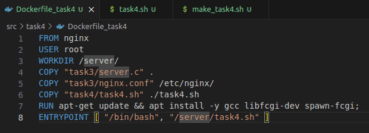
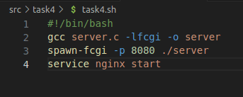
##### Собрать написанный докер образ через `docker build` при этом указав имя и тег
docker build -f Dockerfile -t my_docker_image:task4 "../"
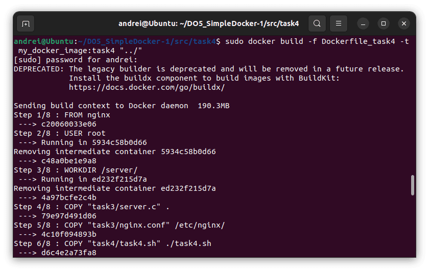
##### Проверить через `docker images`, что все собралось корректно
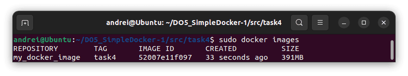
##### Запустить собранный докер образ с маппингом 81 порта на 80 на локальной машине и маппингом папки *./nginx* внутрь контейнера по адресу, где лежат конфигурационные файлы **nginx**'а (см. [Часть 2](#part-2-операции-с-контейнером))
docker run --name my_docker_container -p 80:81 -v $(pwd)/../nginx/nginx.conf:/etc/nginx/nginx.conf -dt my_docker_image:task4
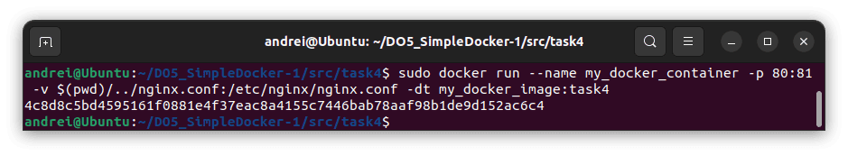
##### Проверить, что по localhost:80 доступна страничка написанного мини сервера
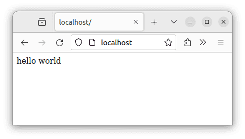
##### Дописать в *./nginx/nginx.conf* проксирование странички */status*, по которой надо отдавать статус сервера **nginx**
##### Перезапустить докер образ
*Если всё сделано верно, то, после сохранения файла и перезапуска контейнера, конфигурационный файл внутри докер образа должен обновиться самостоятельно без лишних действий*
##### Проверить, что теперь по *localhost:80/status* отдается страничка со статусом **nginx**
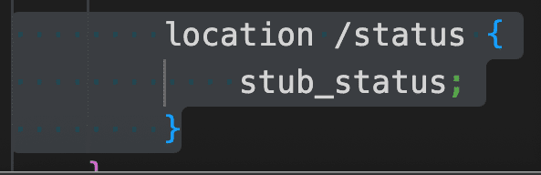
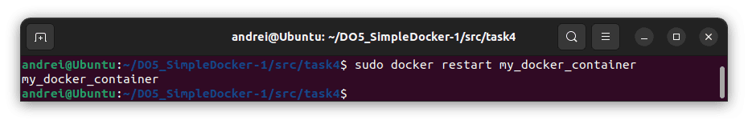
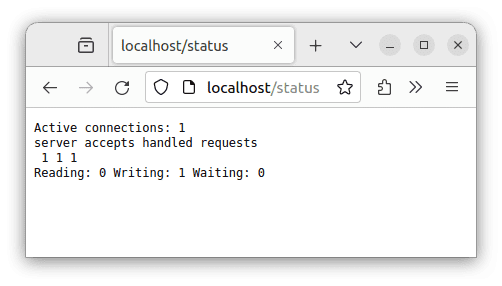

## Part 5. **Dockle**

После написания контейнера никогда не будет лишним проверить его на безопасность.

**== Задание ==**

##### Просканировать контейнер из предыдущего задания через `dockle [container_id|container_name]`
##### Исправить контейнер так, чтобы при проверке через **dockle** не было ошибок и предупреждений
ДО:
dockle my_docker_image:task4
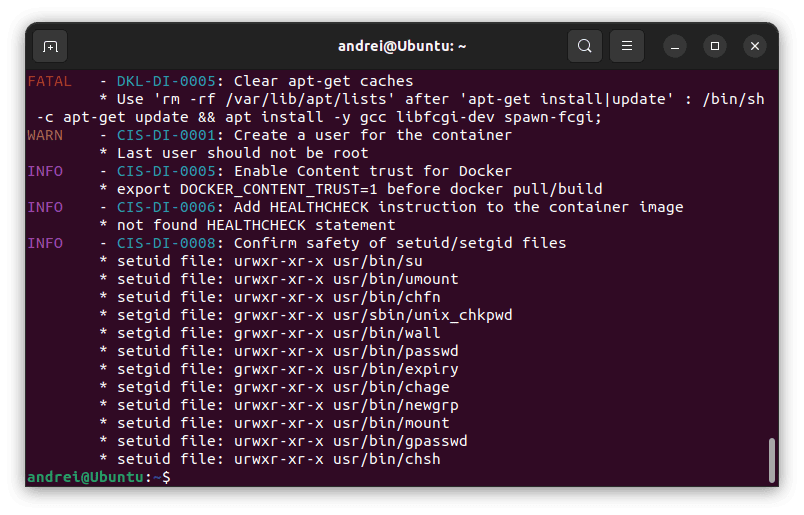
ПОСЛЕ:
docker build -f Dockerfile_task5 -t my_docker_image:task5 "../"
docker run --name my_docker_container -p 80:81 -v $(pwd)/../nginx/nginx.conf:/etc/nginx/nginx.conf -dt my_docker_image:task5
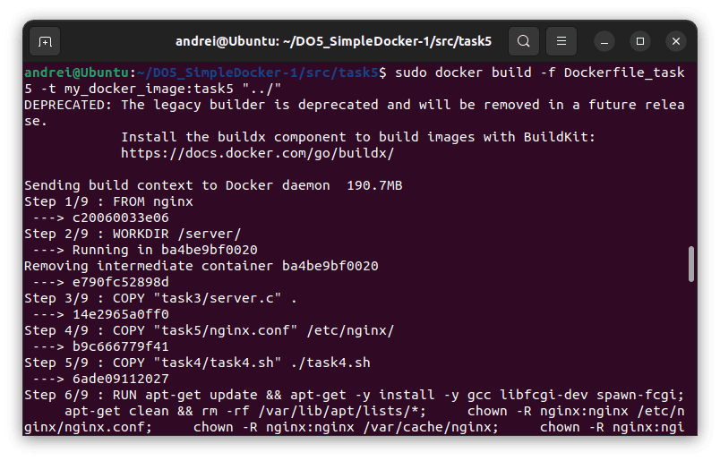
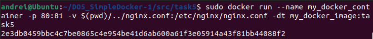
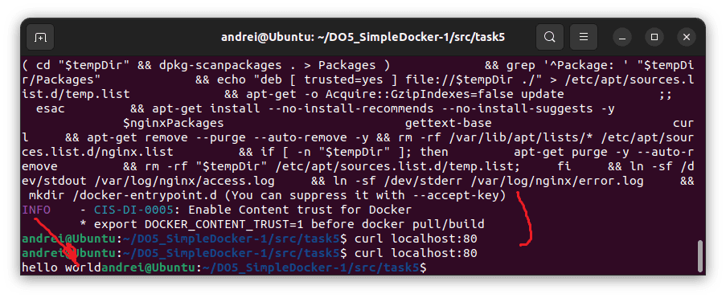

## Part 6. Базовый **Docker Compose**

Вот вы и закончили вашу разминку. А хотя погодите...
Почему бы не поэкспериментировать с развёртыванием проекта, состоящего сразу из нескольких докер образов?

**== Задание ==**

##### Написать файл *docker-compose.yml*, с помощью которого:
##### 1) Поднять докер контейнер из [Части 5](#part-5-инструмент-dockle) _(он должен работать в локальной сети, т.е. не нужно использовать инструкцию **EXPOSE** и мапить порты на локальную машину)_
##### 2) Поднять докер контейнер с **nginx**, который будет проксировать все запросы с 8080 порта на 81 порт первого контейнера
##### Замапить 8080 порт второго контейнера на 80 порт локальной машины
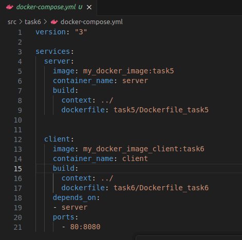
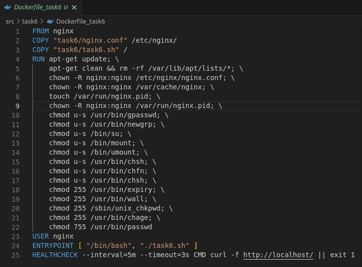
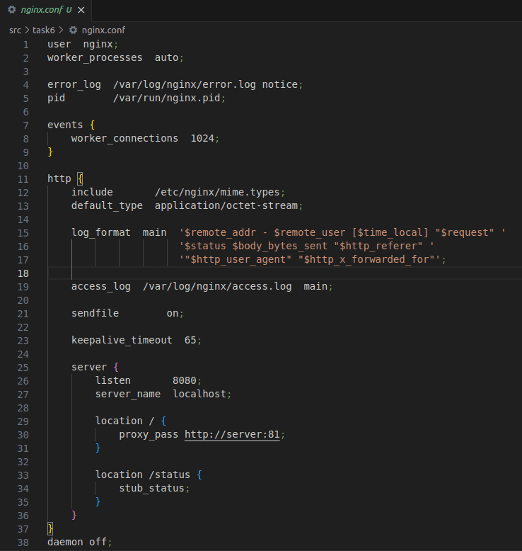

##### Остановить все запущенные контейнеры
docker ps -q | xargs docker stop
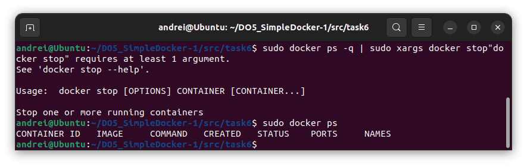

##### Собрать и запустить проект с помощью команд `docker-compose build` и `docker-compose up`
##### Проверить, что в браузере по *localhost:80* отдается написанная вами страничка, как и ранее
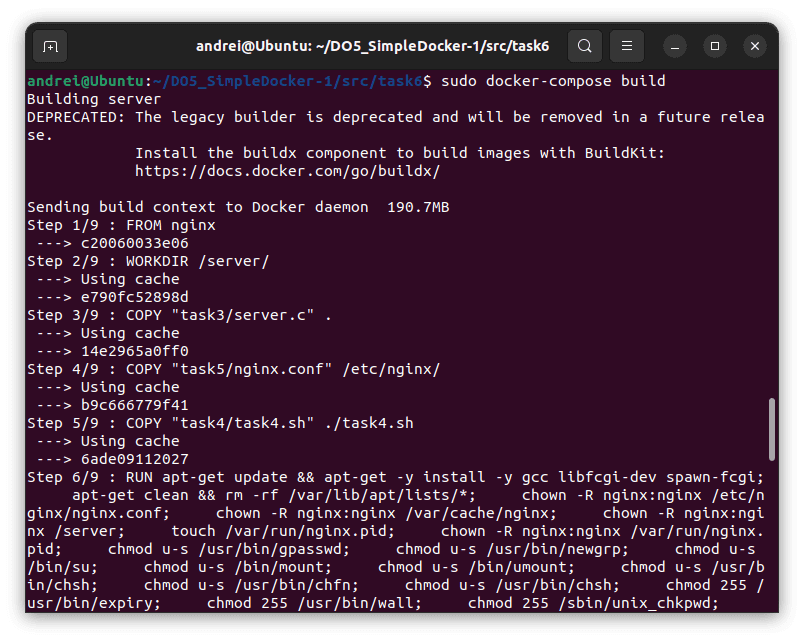
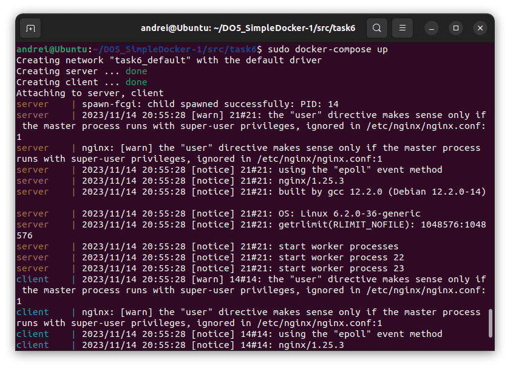

