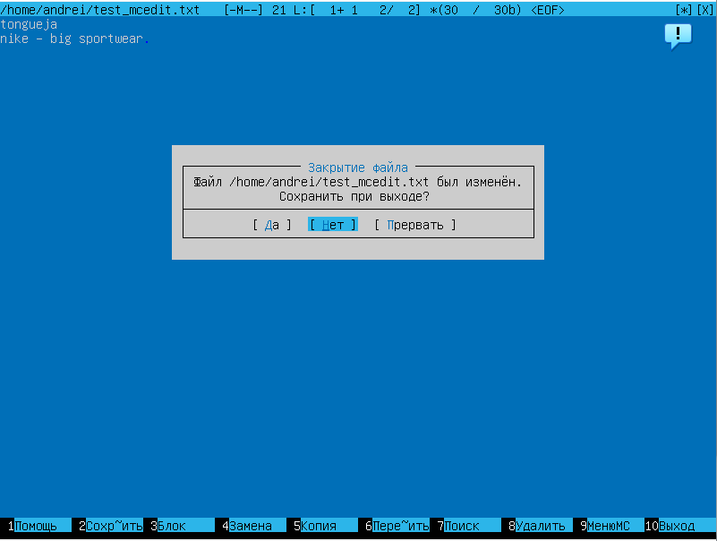
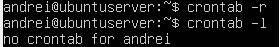

## Part 1. Установка ОС

Устанавливаем VirtualBox и скачиваем Ubuntu 20.04 Server LTS с официального сайта. В VirtualBox создаем новую виртуальную машину, выделяем место на диске и ставим ОС.

Посмотреть версию системы можно в файле /etc/issue.

---

## Part 2. Создание пользователя

useradd - команда создания нового пользователя. Добавляем его в группу adm.

/etc/passwd — файл, содержащий в текстовом формате список пользовательских учётных записей. Новый пользователь был занесен в список.

---
## Part 3. Настройка сети ОС

1) Задать название машины
    ``sudo nano /etc/hostname`` - далее изменил название в редакторе
    
2) Изменил часовую зону 
    ``sudo timedatectl set-timezone Europe/Moscow``

3) Просмотрел сетевые интерфейсы - ``ifconfig -a``:

    

    > lo (loopback device) – виртуальный интерфейс, присутствующий по умолчанию в любом Linux. Он используется для отладки сетевых программ и запуска серверных приложений на локальной машине. С этим интерфейсом всегда связан адрес 127.0.0.1. У него есть dns-имя – localhost. Посмотреть привязку можно в файле /etc/hosts.

4) Используя консольную команду ``sudo dhclient -v`` получить ip адрес устройства

    

    > DHCP (англ. Dynamic Host Configuration Protocol — протокол динамической настройки узла) — прикладной протокол, позволяющий сетевым устройствам автоматически получать IP-адрес и другие параметры, необходимые для работы в сети TCP/IP. Данный протокол работает по модели «клиент-сервер». Сетевой администратор может задать диапазон адресов, распределяемых сервером среди компьютеров. Протокол DHCP используется в большинстве сетей TCP/IP.

5) Определил внешний ip-адрес шлюза ``curl ifconfig.me/ip`` (ip) и внутренний IP-адрес шлюза ``ip route``

    

6) В Ubuntu 20.04 для настройки сети используется утилита netplan.
    Задал статичные настройки ip, gw, dns - ``sudo nano /etc/netplan/00-installer-config.yaml``

    
    
    Чтобы зафиксировать изменения, нужно выполнить команду sudo netplan apply. Перед этим можно сделать проверку с помощью sudo netplan try.

    

7) Успешно пингуем ya.ru и 1.1.1.1 с помощью команды ping.

    

---
## Part 4. Обновление ОС

Команда для синхронизации индекса пакетов из репозиториев:

    sudo apt-get update

Команда для установки самых новых версий пакетов:

    sudo apt-get upgrade

---
## Part 5. Использование команды sudo

Чтобы разрешить пользователю выполнять команду sudo, нужно добавить его в группу sudo. Для этого от имени администратора выполним команду usermod с опциями -a (--append, добавляет пользователя в дополнительные группы) и -G (--groups, список дополнительных групп).

Команда sudo предоставляет возможность пользователям выполнять команды от имени суперпользователя root.

> Root или суперпользователь — это специальный аккаунт и группа пользователей в UNIX-подобных системах с идентификатором пользователя UID 0, владелец которого имеет право на выполнение всех без исключения операций.

Чтобы сменить пользователя, нужно ввести команду su - <имя пользователя>. Перед этим мне понадобилось установить пароль для созданного в Part 2 пользователя с помощью команды sudo passwd <имя пользователя>.

Сменив пользователя, редактируем /etc/hostname.

---
## Part 6. Установка и настройка службы времени

Чтобы включить автоматическую синхронизацию времени, нужно ввести команду sudo timedatectl set-ntp on.

## Part 7. Установка и использование текстовых редакторов

---
**VIM**

---

1. Редактирование + сохранение

    Нажать a для включения режима вставки, вписать никнейм, нажать Esc для выхода из режима вставки, ввести :wq

    

2. Выход без сохранения

    Для выхода без сохранения ввести :q!

    

    

3. Поиск и замена

    Для поиска нажать / и ввести искомое слово, затем нажать Enter. n - перейти к следующему вхождению искомой строки. Команда замены: :[количество обрабатываемых строк]s/{заменяемое}/{заменитель}/[флаги] [количество замен]. Чтобы заменить dog на cat, я ввел :s/dog/cat/g

    

---
**NANO**

---
1. Редактирование + сохранение

    Просто начать вводить текст. Для выхода нажать Ctrl+X, подтвердить сохранение с помощью Y

2. Выход без сохранения

    Для выхода без сохранения нажать Ctrl+X, затем N

    

3. Поиск и замена

    Для поиска нажать Ctrl+W, Enter. Для замены вписать в режиме поиска заменяемое слово, нажать Ctrl+R, вписать слово-замену и нажать Enter. На каждом вхождении искомого слова nano будет спрашивать, заменять ли его. Y - да, N - нет, A - заменить сразу все

    

---
**MCEDIT**

---
1. Редактирование + сохранение

    Для выхода с сохранением изменений - esc - 2 - yes - name file

    

2. Выход без сохранения

    Для выхода без сохранением изменений  - esc - no

    

3. Поиск и замена

    Команда для поиска esc - 7
    Команда для замены esc - 4

    

## Part 8. Установка и базовая настройка сервиса SSHD

Команды для установки SSH и добавления его в автозагрузку:

    sudo apt install openssh-server
    sudo systemctl enable ssh

Порт по умолчанию - 22. Для того, чтобы его изменить, нужно отредактировать файл /etc/ssh/sshd_config, указав нужный номер напротив слова Port. По умолчанию строки записаны в виде комментариев, с символом #. Его нужно удалить.

> ps (от англ. process status) — программа в Unix-подобных операционных системах, выводящая отчёт о работающих процессах. Ключ -А (-е) позволяет вывести все процессы.

Чтобы не искать процесс sshd вручную, можно также воспользоваться grep.

Перезапускаем систему с помощью команды reboot.
Для использования команды netstat понадобилось установить net-tools (sudo apt install net-tools).

> netstat (network statistics) — утилита командной строки, выводящая на дисплей состояние TCP-соединений (как входящих, так и исходящих), таблицы маршрутизации, число сетевых интерфейсов и сетевую статистику по протоколам. Основное назначение утилиты — поиск сетевых проблем и определение производительности сети.

**Используемые в задании ключи:**

- -t (--tcp) - показывать только TCP порты.
- -a (--all) - показывать состояние всех сокетов.
- -n (--numeric) - показывать сетевые адреса как числа (например 127.0.0.53:53 вместо localhost:domain)

    > Сокет (англ. socket — разъём) — название программного интерфейса для обеспечения обмена данными между процессами. Для взаимодействия между машинами с помощью стека протоколов TCP/IP используются адреса и порты. Адрес представляет собой 32-битную структуру для протокола IPv4, 128-битную для IPv6. Номер порта — целое число в диапазоне от 0 до 65535 (для протокола TCP). Эта пара определяет сокет («гнездо», соответствующее адресу и порту). В процессе обмена, как правило, используется два сокета — сокет отправителя и сокет получателя.

**Значения столбцов:**
- ***Proto*** -	протокол, используемый сокетом. Так как была использована опция [-t|--tcp], в выводе пристутвуют только TCP-сокеты.
- ***Recv-Q*** - счётчик байт, не скопированных программой пользователя из этого сокета.
- ***Send-Q*** - счётчик байтов, не подтверждённых удалённым узлом.
- ***Local Address*** - адрес и номер порта локального конца сокета. Если указана опция [-n|--numeric], вывод в формате [адрес сокета:номер порта], иначе - [каноническое имя узла:соответствующее имя службы]. В интересующей нас строчке 0.0.0.0 - адрес локального конца сокета, 2022 - номер порта, который мы поменяли с 22 на 2022. Адрес 0.0.0.0 означает, что удаленный конец сокета будет доступен всем локальным ip-адресам.
- ***Foreign Address*** - адрес и номер порта удалённого конца сокета.
- ***State*** - состояние сокета. Состояние LISTEN означает, что сокет ожидает входящих подключений.

---
## Part 9. Установка и использование утилит top, htop

Информация о состоянии системы из вывода утилиты top (Table Of Processes):

- **uptime (как долго работает система)** - 4 минуты
- **количество авторизированных пользователей** - 1
- **общая загрузка системы** - 0.02 (система в состоянии простоя)
- **общее количество процессов** - 113
- **загрузка cpu** - 3.3% процессорного времени было направлено на процессы пользователя, 96.7% времени процессор был в состоянии покоя
- **загрузка памяти** - всего есть 3931.8 мебибайт оперативной памяти (1 мебибайт = 2^20 байт, 3931.8 мебибайт ≈ 4 гигабайта): из них 163.1 занято, 3414.2 свободно, 354.6 занимает кэш системы.
- **PID процесса, занимающего больше всего памяти** - 692

    

- **PID процесса, занимающего больше всего процессорного времени** - 1076

    

Работа с утилитой htop:

- Сортировка(F3):
    - по PID:

        

    - по PERCENT_CPU:

        

    - по PERCENT_MEM:

        

    - по TIME:

        

- Фильтрация (F4) для процесса sshd:

    

- Поиск (F3) процесса syslog:

    

- С выводом hostname, clock и uptime (настройка вывода F2):

    

    

---
## Part 10. Использование утилиты fdisk

    sudo fdisk -l > diskinfo.txt; nano diskinfo.txt

В выводе пристутствует пять разделов /dev/loop* и один /dev/mapper/ubuntu* - они созданы ядром. Нас интересует /dev/sda - информация о жестком диске в целом.

**Имя:** /dev/sda

**Размер:** 25 гибибайт

**Количество секторов:** 52428800

**Размер swap:** 2301 мебибайт

---
## Part 11. Использование утилиты df

Корневой раздел (/):
- Информация из команды df:

    
    
    - **размер раздела** - 11139652
    - **размер занятого пространства** - 5141356
    - **размер свободного пространства** - 5998296
    - **процент использования** - 47%

    Используемая единица измерения - килобайты.

- Информация из команды df -Th:

    

    - **размер раздела** - 12 Гб
    - **размер занятого пространства** - 5.0 Гб
    - **размер свободного пространства** - 5.8 Гб
    - **процент использования** - 47%

    Тип файловой системы - ext4.

---
## Part 12. Использование утилиты du

Вывод du для /home, /var, /var/log сначала в байтах, затем в человекочитаемом виде.

Размер всего содержимого в /var/log.

---
## Part 13. Установка и использование утилиты ncdu

    sudo apt install ncdu
    sudo ncdu /

Для навигации среди списка директорий используются стрелки, Enter для выбора.

Сравнение вывода du и ncdu:

|            | du          | ncdu       |
| :---       |    :----:   |       ---: |
| /home      | 132 КiB     | 132 KiB    |
| /var       | 663 МiB     | 771.3 MiB  |
| /var/log   | 109 МiB     | 108.5 Mib   |

---
## Part 14. Работа с системными журналами

***/var/log/dmesg*** содержит информацию о драйверах устройств.

***/var/log/syslog*** содержит глобальный системный журнал, в котором пишутся сообщения от ядра Linux, различных служб, сетевых интерфейсов и т.д. с момента запуска системы.

***/var/log/auth.log***  — информация об авторизации пользователей, включая удачные и неудачные попытки входа в систему, а также задействованные механизмы аутентификации.

Информация об авторизации:

    sudo grep -a login /var/log/auth.log

Мы видим, что последняя успешная авторизация была выполнена 7 июня в 13:31:29 пользователем andrei. Метод входа называется LOGIN.

Перезапуск ssh:

    sudo systemctl restart sshd

Сообщения о перезапуске в /var/log/syslog:

---
## Part 15. Использование планировщика заданий CRON

Команда для редактирования конфигурационного файла cron активного пользователя:
    
    crontab -e

Посмотреть этот файл: 

    crontab -l

Записи в /var/log/syslog:

Удаление конфигурационного файла:

    crontab -r

Попытка вывести список задач после удаления:

